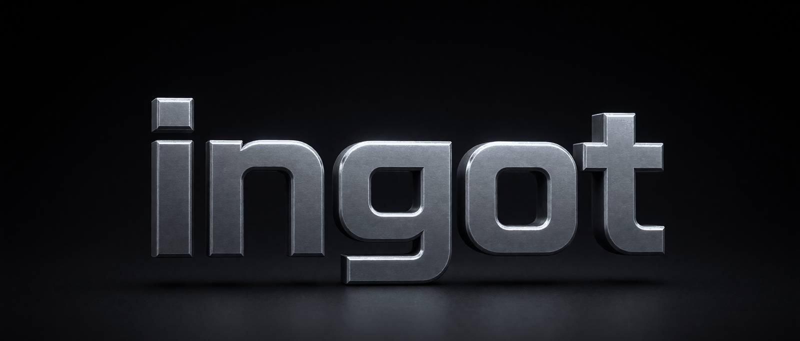

<p align="center">
  
</p>

**여러 축에서 동시에 이기는 것**을 목표로 만든 손실 이미지 코덱입니다. 압축률 하나만 보지 않습니다. 이것이 **v1.7** 입니다.

[English](README.md)

대부분의 코덱은 한 성질을 얻으려고 다른 성질을 내줍니다. ingot 은 아무도 최적화하지 않아 비어 있던 축을 골라, 그것을 포맷 자체에 못박았습니다.

- **JPEG 과 WebP 를 세 지표 모두에서 앞섭니다** — 표준 사진에서 JPEG 대비 **−31.6%**(PSNR), **−30.8%**(SSIM), **−21.8%**(SSIMULACRA2), WebP 대비 **−14.5%**, **−6.2%**, **−11.0%** 입니다. JPEG XL 은 PSNR 로 **−10.9%** 앞섭니다. AVIF 는 아직 우리보다 앞서 있습니다 — 지각 지표로 **+18.2%** 차이이고, 하루 전 +32.8% 에서 줄어든 값입니다.
- **비트 단위로 같습니다** — 정수 연산만 쓰고 라이브러리 안에 부동소수점 연산이 하나도 없습니다. 같은 입력은 언제나 같은 바이트를 냅니다.
- **스레드 수가 비트스트림에 들어가지 않습니다** — 스레드를 몇 개 쓰든 나오는 바이트가 같습니다. 대가는 실재하고 조각이 작아질수록 커집니다: 기본값 256 에서 **2.7%**, 64 에서 **29.7%** 입니다(한 장을 한 조각으로 담은 것과 견줌, 6장·품질 6단계). 기존 표준의 타일링이 3.7~8% 이므로, 기본값 근처에서만 앞섭니다.
- **작습니다** — `src/` 의 C99 코드가 2,468 줄이고 그중 1,832 줄이 디코딩 경로입니다. 이 수에는 라이선스 머리말 128 줄과 1.4KB 학습 확률표가 들어 있고, 코드만 세면 2,340 줄입니다. libc 말고는 의존하는 것이 없습니다.
- **망가진 입력이 들어온다고 전제합니다** — 디코더는 오류 코드를 돌려줄 뿐 죽지 않습니다. 손상 파일 300 건에 비정상 종료 0 건입니다.

```console
$ sh build.sh
built: ./ingot

$ ./ingot enc photo.ppm photo.igt 20
896x1110  q20  -> 136694 bytes (source 2983680, 4.58%)

$ ./ingot dec photo.igt out.ppm
decoded 896x1110

$ ./ingot rt photo.ppm 20
896x1110 q20 group 256  4:4:4 |   136694 B (  4.58%) | maxdiff 117 | PSNR  24.08 dB
```

입출력은 PPM(P6, 8비트)만 받습니다. 다른 포맷은 ffmpeg 로 바꿔서 넣습니다.

## 지금 어디까지 왔는가

AOM 공통 시험 집합 8 장, 품질 6 단계, 기계 한 대, 2026-08-23 실측입니다. BD-rate 는 단조를 지키는 보간(PCHIP)으로 계산했습니다. **음수면 같은 품질에서 우리가 비트를 덜 쓴다는 뜻입니다.**

| 상대 | PSNR | SSIM | SSIMULACRA2 |
|---|---|---|---|
| JPEG | **−31.6%** | **−30.8%** | **−21.8%** |
| WebP | **−14.5%** | **−6.2%** | **−11.0%** |
| JPEG XL | **−10.9%** | +5.3% | +17.7% |
| AVIF | +45.8% | +42.2% | +18.2% |

**셋째 칸 때문에 v1.1 이 있습니다.** v1.0 까지 이 코덱은 제곱 오차 하나만 보고 다듬어졌습니다. 지각 지표를 붙여 보니, PSNR 로는 WebP·JPEG XL 을 앞서는 것처럼 보이던 그 설정에서 **JPEG 에게조차 SSIMULACRA2 로 지고 있었습니다(+5.6%)**. 규격 상수 하나 — 높은 자리의 계수를 얼마나 더 거칠게 양자화할 것인가 — 를 올리자 JPEG 대비 +5.6% 에서 **−11.3%** 로 돌아섰습니다. 대가는 PSNR 2.4 포인트입니다. v1.1 은 그 거래를 받아들인 판입니다.

**비교 설정에 두 가지를 밝혀 둡니다. 하나는 우리에게 불리하고 하나는 유리합니다.** libwebp 에는 손실 4:4:4 모드가 없습니다 — `yuv420p` 만 받습니다. 반면 ingot·JPEG·AVIF 는 모두 4:4:4 로 쟀습니다. 그러니 색이 중요한 그림에서 WebP 칸은 WebP 를 실제보다 나쁘게 적은 것입니다. 우리 WebP 성적의 정직한 해석은 "우리가 더 잘 압축한다" 가 아니라 "WebP 는 색을 온전히 담은 채로는 이 비교에 들어오지 못한다" 입니다. 반대쪽으로, AVIF 는 `cpu-used 6` 으로 불렀습니다. libaom 의 압축률을 실제로 깎는 빠른 설정입니다. 그러니 위 표의 AVIF 격차는 실제보다 *작게* 적힌 것입니다.

SSIMULACRA2 는 정지 이미지를 위해 설계된 지각 지표입니다. 원 저장소가 실행 파일을 배포하지 않아 파이썬 구현을 씁니다. 한 장에 이 초쯤 걸릴 만큼 느리고, 그래서 앞의 두 지표를 대체하지 않고 셋을 함께 냅니다.

### 우리가 실제로 만드는 소재에서

우리가 만드는 이미지 12 장(AI 생성 이미지·UI 스크린샷·게임 스프라이트 각 4 장)입니다.

| 상대 | PSNR | SSIM | SSIMULACRA2 |
|---|---|---|---|
| JPEG | **−45.3%** | **−37.8%** | **−36.7%** |
| WebP | **−22.3%** | **−17.4%** | **−8.3%** |
| JPEG XL | **−30.5%** | **−17.8%** | +22.2% |
| AVIF | +82.8% | +93.3% | +56.2% |

이 소재에서는 JPEG 과 WebP 를 세 지표 모두에서, JPEG XL 을 셋 중 둘에서 앞섭니다.

### 나머지 축

| 축 | 상태 | 근거 |
|---|---|---|
| 결정성 | **됨** | 두 번 인코딩하면 바이트가 같습니다. `src/` 에 부동소수점 연산 0 개 |
| 병렬성 | **포맷에서는 됨, 대가가 처음 잰 것보다 큼** | 한 장을 한 조각으로 담은 것과 견주면 256(기본) **+2.9%**, 128 +10.2%, 64 **+29.8%** 입니다(2026-08-23 재측정). 2026-08-22 까지 여기 적혀 있던 1.4% 는 산술 부호화를 넣기 전에 잰 값입니다. 지금은 조각 경계마다 확률표를 처음부터 다시 배우므로, 조각이 작으면 배울 표본이 모자랍니다. 인코더가 조각마다 자기 자리에 담으므로 OpenMP 빌드에서는 병렬로 돕니다 — 이 기계에는 OpenMP 런타임이 없습니다 |
| 단순성 | **예산 안, 다만 누구와도 겨룬 적 없음** | 디코딩 경로 1,832 줄, 전체 2,468 줄(그중 128 줄이 라이선스 머리말), 외부 의존 0, 규격 14 쪽 이내. 2026-08-23 에 관여하지 않은 판정자가 훑어 **아무도 안 부르는 316 줄**을 찾았습니다 — 산술 부호화가 대신한 뒤 남아 있던 골롬-라이스 비트 입출력 파일 통째입니다. 빼도 출력이 한 바이트도 안 달라졌습니다. 이 축에서 상대를 재본 적이 없습니다 |
| 특허 | 만료된 기술만 | DCT(1974), 골롬(1966), 산술 부호화(1970년대 후반). **법률 검토는 아직 안 했습니다** |
| 디코딩 속도 | **다섯 중 꼴찌, 다만 더 나빠지지는 않음** | 실측 0.171 초입니다. JPEG 0.063, WebP 0.079, JXL 0.088, AVIF 0.085 이고 모두 프로세스 시작 시간이 들어 있습니다. v1.7 은 디코더에 경계 필터를 붙였는데도 v1.6 의 0.178 초보다 **빨라졌습니다** — 답이 정해진 깃발을 안 읽게 되면서 아낀 것이 필터 비용보다 컸습니다. 그래도 두 배 차이로 꼴찌입니다 |
| 인코딩 속도 | **AVIF 말고는 다 뒤짐** | 2.74 초입니다. JPEG 0.083, WebP 0.157, JXL 0.234 이고 AVIF 는 6.41 초입니다. v1.6 의 1.64 초에서 늘어난 것은 인코더가 이제 잔차 절대합 상위 둘 대신 네 모드를 다 담아 보기 때문입니다. 그 거래로 BD-rate 를 2.1% 벌었고, 빌드 시점 손잡이(`INGOT_MODE_TRIALS`)로 되돌릴 수 있습니다 |

색차 절반(4:2:0)은 기본으로 꺼져 있고 표준 사진에서는 손해로 측정됩니다(JXL 대비 PSNR +1.4%, 4:4:4 는 +0.1%). **스크린샷에서 8.5 dB** 를 잃으므로 글자나 UI 에는 절대 켜지 마십시오.

## 포맷에 무엇이 들어갔고, 그것이 얼마짜리였는가

하나씩 넣고 재서 나아질 때만 남겼습니다. 되돌린 실험도 함께 적습니다 — 왜 실패했는지가 설계의 일부이기 때문입니다.

| 바꾼 것 | PSNR BD-rate | SSIM BD-rate |
|---|---|---|
| 인트라 예측 4 모드 | −34.4% | −21.0% |
| 가변 블록 크기, 율왜곡 기준 선택 | 약 −8% (JPEG 을 넘음) | |
| 이진 산술 부호화 (레인지 코더) | −1.0% → **−16.7%** | +7.9% → **−9.9%** |
| 계수 무리에 이웃 계수 크기 추가 | −16.7% → **−17.6%** | −9.9% → **−10.9%** |
| 양자화 데드존 (절반 대신 5/16 에서 반올림) | −17.6% → **−25.1%** | −10.9% → **−19.8%** |
| 4×4 블록 (16 → 8 → 4 재귀 분할) | −25.1% → −24.2% | WebP 대비 +4.4% → **+2.7%** |
| 블록 머리말 무리를 크기별로 분리 | −24.2% → **−24.6%** | −19.7% → **−20.1%** |
| 인코더의 분할 조기 종료 | −24.6% → **−25.6%**, 게다가 1.6배 빠름 | −20.1% → **−21.0%** |
| 계수 무리를 블록 크기로도 가름 | −25.6% → **−25.7%** | 그대로 |
| 고주파 양자화 가중치 (v1.1) | −25.7% → −23.3% | SSIMULACRA2 **+5.6% → −11.3%** |
| 0 의 연속을 개수로 묶기 | **+6.2% (되돌림)** | **+6.6% (되돌림)** |
| 32×32 블록 | **+13.2% (되돌림)** | |
| 예측 모드 늘리기 — 세 번 시도 | **+0.7~0.9%p (되돌림)** | |
| 블록 경계 필터 (뒤처리) | **+2~7%p (되돌림)** | |
| 꼬리 계수 자르기 | **+4%p (되돌림)** | |
| 예측 방향에 맞춘 변환(ADST) | **+6.4%p (되돌림)** | **+7.5%p (되돌림)** |
| 평면 모드를 TM · Paeth 로 교체 | **+0.9~1.5%p (되돌림)** | |
| 모드 값을 후보마다 실측 (v1.7, 인코더 전용) | **−0.7%** | −0.4% |
| 위 둘 대신 네 모드를 다 담아 보기 (v1.7, 인코더 전용) | **−2.1%** | −1.7% |
| 답이 정해진 깃발을 안 적기 (v1.7) | **−4.9%** | **−4.3%** |
| 블록 경계 필터 (v1.7, 디코더 전용, 비트 0) | **−7.2%** | **−7.7%** |
| 계수 크기를 율왜곡으로 낮추기 | **+0.6%p, SSIMULACRA2 는 +3.6%p (되돌림)** | |
| 블록의 거칠기로 λ 조절 | **SSIMULACRA2 +7.2%p (되돌림)** | |
| 계수 부호에 문맥 모델 | **천장이 0.55%, 안 넣음** | |
| 평면 밖 블록 건너뛰기 | **0.0%, 안 넣음** | |
| 구별되지 않는 모드에 비트 안 내기 | **동률, 안 넣음** | |

**되돌린 것 가운데 둘은 되돌린 판단이 틀렸고, 왜 틀렸는지가 이 표에서 가장 쓸모 있는 대목입니다.**

경계 필터를 되돌린 것은 2026-08-21 16:08 이고, 지각 지표가 측정기에 붙은 것은 같은 날 23:16 입니다. 평활 필터는 PSNR 과 SSIM 이 가장 못 보는 종류인데, 그 둘만으로 재고 버렸습니다. 평탄 판정과 모서리 판정을 넣어 다시 짓고 세 지표로 재니 **SSIMULACRA2 로 4.8%p** 를 벌고 비트는 한 바이트도 안 씁니다. v1.7 부터 포맷에 들어 있습니다.

예측 모드를 늘리는 갈래가 세 번 진 것은 이유가 다릅니다. 인코더가 모드를 고를 때 그 모드를 적는 값을 안 보고 있었습니다. 모드 기호의 값은 선택 반복문이 **끝난 뒤** 네 후보에 똑같은 상수로 더해졌고, 그래서 싼 모드와 비싼 모드의 차이가 정확히 0 이었습니다. 값을 제대로 매기고 네 모드를 다 담아 보는 것만으로 **−2.1%** 입니다. 모드를 늘리는 실험은 이 수리 뒤에 해야 합니다.

원래 주장에서 살아남은 것은 ADST 뿐입니다. 그것은 여전히 변환을 골라 쓸 방향 모드가 넉넉해야 값을 하는데, 우리 모드는 아직 넷입니다.

되돌린 이유까지 적은 전체 기록은 [SPEC.md](SPEC.md) 에 있습니다.

## 설계 규칙

1. 규격을 먼저 고치고 코드를 나중에 고칩니다. 반대 순서로 하지 않습니다.
2. 모든 변경은 고정된 시험 집합에서 세 지표(PSNR·SSIM·SSIMULACRA2)로 재고 나서야 남깁니다.
3. 예약 비트는 *켜져 있으면 거부한다* 는 뜻입니다. 옛 디코더가 새 파일을 짐작해서 읽는 일이 없습니다.
4. 디코더는 오류 코드를 돌려줍니다. 중단하지 않고, 버퍼 밖을 읽지 않습니다.

## 파일 배치

```
SPEC.md            규격 원본 (한국어)
src/ingot.h        공개 C API
src/*.c            라이브러리. libc 말고는 의존 없음
tools/cli.c        명령줄 앞단
tools/bench.py     JPEG/WebP/AVIF/JXL 대비 BD-rate 측정, 지표 셋
tools/speed.py     인코딩·디코딩 시간 측정
test/run_tests.py  결정성·왕복·골든 파일·손상 입력 시험
```

## 언어에 대하여

프로그램 출력과 두 README 는 영어입니다. 소스 주석과 `SPEC.md`, 시험 스크립트는 한국어입니다. 이것이 설계된 언어이고, 통일성보다 그 안의 사고 과정이 더 값지기 때문입니다.

## 라이선스

Apache License 2.0. [LICENSE](LICENSE) 와 [NOTICE](NOTICE) 를 보십시오.

상용 제품에 넣어도 되고 소스를 열 필요가 없습니다. 대신 라이선스가 요구하는 것이 표시입니다. 4조 d항이 재배포물에 NOTICE 파일의 내용을 실으라고 하고, 6조가 그 재현을 상표 조항의 예외로 못박습니다. 여기 NOTICE 는 두 줄입니다 — 이름과 어디서 온 것인가.
